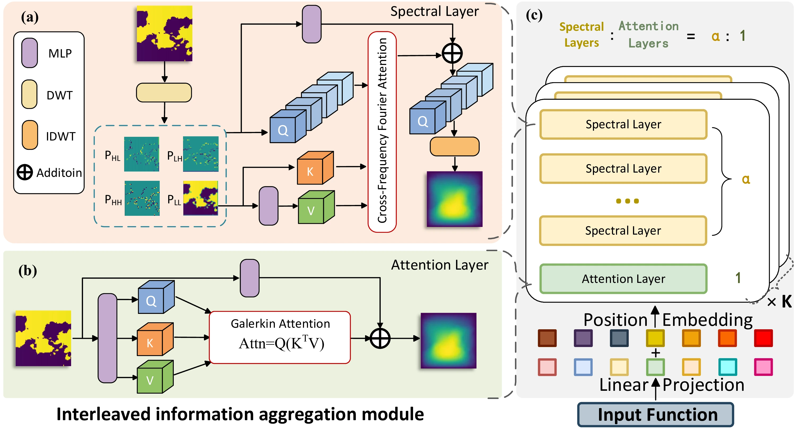
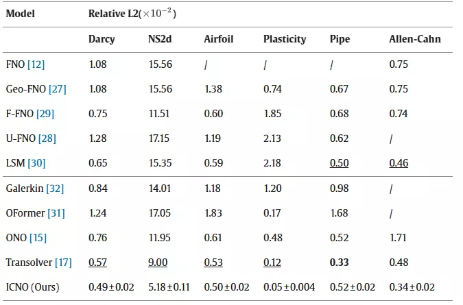
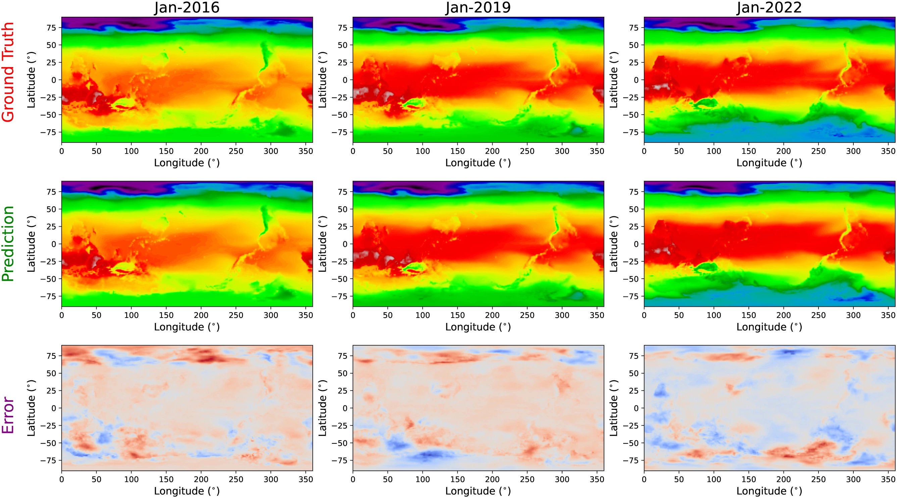

# ICNO （CMAME 2026）
Information-Coupled Neural Operator for Computational Mechanics and Parametric PDEs[Paper](https://www.sciencedirect.com/science/article/abs/pii/S0045782526001258)


The main contributions of ICNO are threefold:

- We elaborate an efficient Cross-frequency Fourier Attention mechanism that couples multi-scale information in the Wavelet domain. The proposal simultaneously reduces spatial and temporal complexities, delivering superior efficacy and efficiency compared to current methods.
- We present a wavelet block to separate and reconstruct information components, along with an interleaved module to balance global-local information. By coupling spectral learning with attention computation, the method is able to capture a richer set of spectral-spatial features.
- We systematically explore cross-spectral coupling mechanisms and distill an effective integration recipe that consistently enhances operator learning.

<p align="center">
  
<br><br>
<b>Figure 1.</b> Overview of ICNO.
</p>

## Results
<p align="center">
  
<br><br>
<b>Figure 2.</b> Results on six standard benchmarks.
</p>

## Showcases
<p align="center">
  
<br><br>
<b>Figure 3.</b> Visualization of the ERA5 2-meter air temperature prediction results.
</p>

## Citation
If you find this repo useful, please cite our paper. 

```
@article{chen2026information,
  title={Information-Coupled neural operator for computational mechanics and parametric PDEs},
  author={Chen, Yihan and Lu, Wenbin and Xu, Junnan and He, Yuhang and Li, Wei and Zheng, Jianwei},
  journal={Computer Methods in Applied Mechanics and Engineering},
  volume={453},
  pages={118851},
  year={2026},
  publisher={Elsevier}
}
```

## Acknowledgement

We appreciate the following github repos a lot for their valuable code base or datasets:

https://github.com/neuraloperator/neuraloperator

https://github.com/neuraloperator/Geo-FNO

https://github.com/csccm-iitd/WNO

### Dataset

- The datasets for Airfoil, Pipe, Plasticity are taken from the following link: [[Dataset]](https://drive.google.com/drive/folders/1YBuaoTdOSr_qzaow-G-iwvbUI7fiUzu8)
- The datasets for Darcy ('Darcy_421.zip'), Navier-Stokes ('ns_V1e-3_N5000_T50.zip') are taken from the following link: [[Dataset]](https://drive.google.com/drive/folders/1UnbQh2WWc6knEHbLn-ZaXrKUZhp7pjt-)
- The dataset for Allen-Cahn is sourced from the following link: [[Dataset]](https://drive.google.com/drive/folders/1scfrpChQ1wqFu8VAyieoSrdgHYCbrT6T). Climatic data related to the 2 m air temperature and surface pressure are downloaded from the *European Centre for Medium-Range Weather Forecasts (ECMWF)* database. [[ECMWF]](https://www.ecmwf.int/en/forecasts/datasets/browse-reanalysis-datasets)
